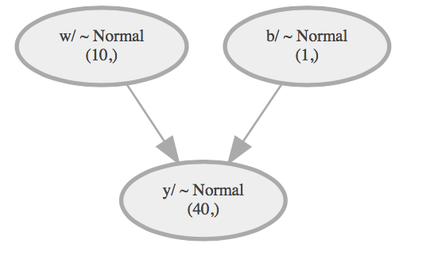
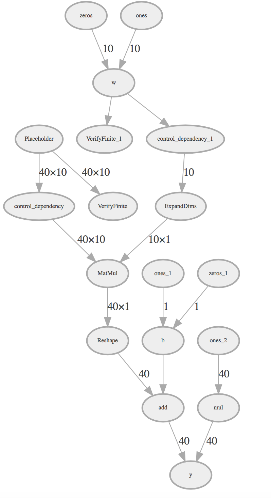

## ed_viz - Tensorflow/Edward Graph Visualize 

A small python script to visualize tensorflow graph especially for edward (edwardlib.org). 
Requires Edward,  Graphviz software (Graphviz.org) and python graphviz library (pip install graphviz)

Install ed_viz
---------------

`pip install git+https://github.com/Arvinds-ds/ed_viz.git`


```
import ed_viz

from edward.models import Normal

X = tf.placeholder(tf.float32, [N, D])
w = Normal(loc=tf.zeros(D), scale=tf.ones(D), name='w')
b = Normal(loc=tf.zeros(1), scale=tf.ones(1), name='b')
y = Normal(loc=ed.dot(X, w) + b, scale=tf.ones(N)*0.1,name='y')

```

Simple visualization of all edward variables in current graph 
```

ed_viz.visualize_simple()

```



Detailed Visualization of entire computation graph including edward variables
```
ed_viz.visualize_full(depth=1) # change depth to see varying details

```
